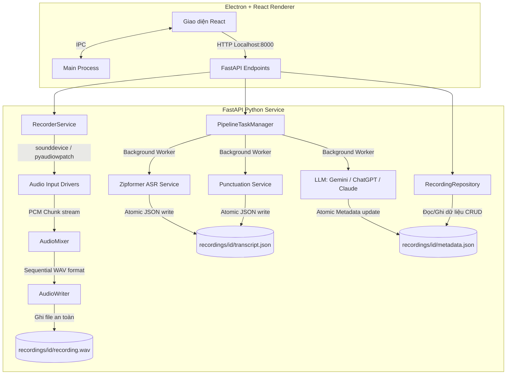
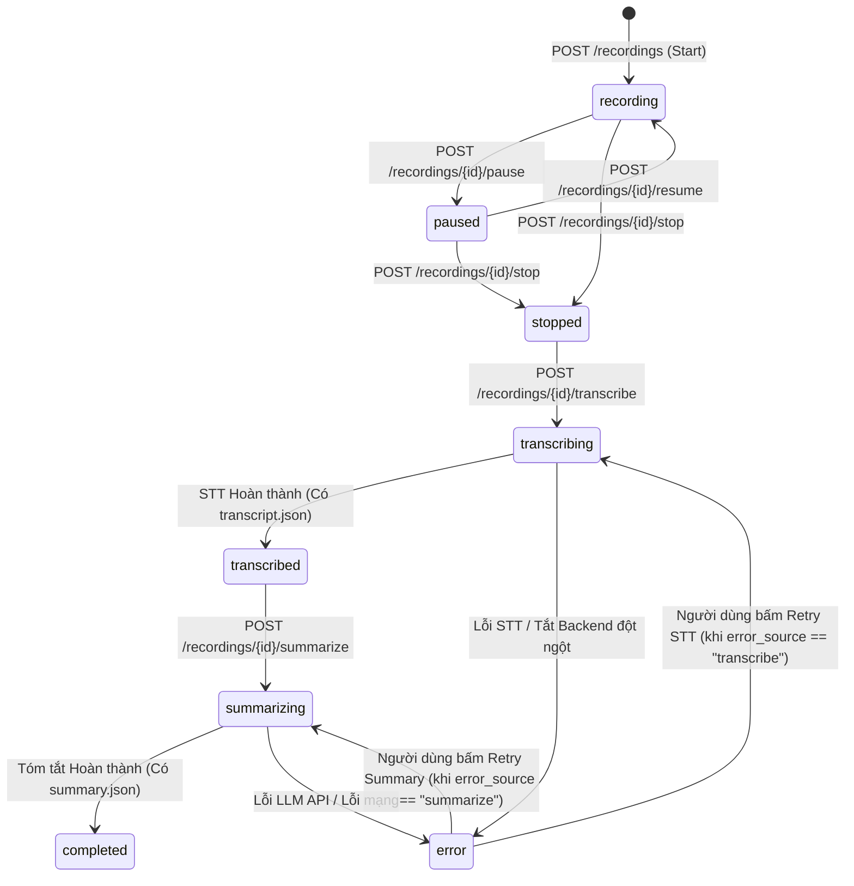

# Kiến trúc Hệ thống — AI Recorder

Tài liệu này mô tả chi tiết kiến trúc runtime, các luồng dữ liệu (data pipelines), trách nhiệm của các thành phần và máy trạng thái (state machine) của dự án AI Recorder.

---

## 1. Sơ đồ Kiến trúc Tổng quan (System Overview)

AI Recorder được xây dựng theo mô hình **Thin Client** (Electron/React đóng vai trò hiển thị giao diện và điều khiển, trong khi toàn bộ logic ghi âm và xử lý AI chạy trên Backend FastAPI local).



### Trách nhiệm các thành phần:
* **Frontend (Electron/React):** Đảm nhiệm vẽ giao diện, quản lý danh sách bản ghi, điều khiển trình phát Audio (WAV playback), gọi trigger tác vụ và xuất báo cáo Markdown thông qua API của Electron. Triển khai giao diện chính tại [App.tsx](file:///d:/KProject/AIRecorder/frontend/src/renderer/src/App.tsx). Giao diện giao tiếp trực tiếp với Backend FastAPI qua REST API local.
* **FastAPI Backend:** Đóng vai trò là cổng điều khiển chính, tiếp nhận các request từ Frontend, kiểm tra điều kiện validation và phân phối tác vụ cho các service chuyên biệt dưới dạng bất đồng bộ. Khởi chạy tại [main.py](file:///d:/KProject/AIRecorder/backend/app/main.py).
* **Recorder Service:** Điều phối thiết bị phần cứng, chạy mixer để trộn Microphone và System Loopback, sử dụng `AudioWriter` ghi PCM 16-bit vào file WAV trên đĩa. Triển khai tại [recorder.py](file:///d:/KProject/AIRecorder/backend/app/services/recorder.py) và [audio_writer.py](file:///d:/KProject/AIRecorder/backend/app/services/audio_writer.py).
* **Pipeline Task Manager:** Hàng đợi tác vụ ngầm chạy đơn nhiệm (single-task worker thread) để thực hiện các công việc nặng về CPU/Mạng (STT, Dấu câu, AI Summary) mà không làm nghẽn luồng xử lý chính của web API. Triển khai tại [pipeline.py](file:///d:/KProject/AIRecorder/backend/app/services/pipeline.py).

---

## 2. Luồng Recording & Quản lý File (Data Directory Layout)

Mỗi bản ghi âm (Session) khi được tạo ra sẽ có một thư mục riêng biệt được tự đóng gói (self-contained) nằm trong thư mục `recordings/` ở thư mục gốc của dự án:

```text
recordings/{id}/
├── recording.wav    # File ghi âm gốc (PCM 16-bit, 16kHz, Mono)
├── metadata.json    # Metadata mô tả bản ghi (thời gian tạo, duration, summary, action items)
├── transcript.json  # File văn bản thô kèm segment timestamp (tạo sau khi STT xong)
└── summary.json     # Dữ liệu tóm tắt AI chi tiết (tạo sau khi Summarize xong)
```

### Quy trình thu âm:
1. Client gửi `POST /api/v1/recordings` kèm cấu hình thiết bị.
2. `RecorderService` tạo một `RecordingSession`, ghi file `metadata.json` ban đầu với trạng thái `recording`.
3. Audio callback được kích hoạt để lắng nghe các PCM chunk từ thiết bị. Luồng phụ (Worker thread) ghi chunk liên tục vào file WAV để tránh trễ driver.
4. Khi bấm **Pause**, driver vẫn hoạt động nhưng callback sẽ tạm dừng đẩy chunk vào queue.
5. Khi bấm **Stop**, source thiết bị được đóng lại, file WAV được finalize và cập nhật duration thực tế vào `metadata.json`.

---

## 3. Máy Trạng thái Bản ghi (Recording State Machine)

Trạng thái của một bản ghi được lưu trữ trong thuộc tính `state` của `metadata.json` và được cập nhật liên tục qua các API:



* Trạng thái `completed` là trạng thái cuối cùng và trọn vẹn nhất (đã có cả văn bản dịch và tóm tắt AI).
* Khi một tác vụ dịch (`transcribing`) hoặc tóm tắt (`summarizing`) bị lỗi (do model, do mạng, hoặc backend restart giữa chừng), hệ thống chuyển trạng thái sang `error`.
* Thuộc tính `error_source` trong metadata sẽ lưu trữ `"transcribe"` hoặc `"summarize"` để giao diện hiển thị nút Thử lại (Retry) tương ứng.

---

## 4. Đặc tả Tác vụ Nền (Pipeline Execution)

Để tránh xung đột tài nguyên và quá tải CPU trên Windows, luồng xử lý AI chạy theo cơ chế:
1. **Tuần tự (FIFO Queue):** Các tác vụ STT và Summarize được gửi vào hàng đợi và xử lý từng cái một.
2. **Lazy-loading:** Các thư viện nặng như `sherpa-onnx` và mô hình `ViBERT-capu` không được load lúc bật server mà chỉ load một lần duy nhất khi người dùng bấm transcribe lần đầu.
3. **Phân rã segments:** Tác vụ STT tách tệp âm thanh thành các segment nhỏ để khôi phục dấu câu bằng mô hình ONNX, sau đó tổng hợp thành file `transcript.json` hoàn chỉnh trước khi cập nhật trạng thái bản ghi trở lại.

---

## 5. Quyết định Thiết kế: Chạy local mặc định 100% trên CPU (CPU-only Execution)

Hệ thống được thiết kế chạy mặc định hoàn toàn trên **CPU** thay vì yêu cầu tăng tốc phần cứng qua GPU (CUDA/DirectML) vì các lý do chiến lược sau:

1. **Khả năng Tương thích Tối đa (Compatibility out-of-the-box):**
   * Đối với ứng dụng desktop phân phối cho người dùng Windows, việc yêu cầu card đồ họa rời NVIDIA và bắt cài đặt bộ thư viện CUDA Toolkit/cuDNN là rào cản kỹ thuật quá lớn đối với đại đa số người dùng văn phòng thông thường.
   * Chạy trên CPU đảm bảo ứng dụng **sẵn sàng sử dụng 100%** ngay sau khi cài đặt trên mọi dòng máy tính (bao gồm cả máy dùng card onboard của Intel/AMD hoặc dòng chip ARM).
2. **Hiệu năng CPU đã quá tối ưu:**
   * Thông qua đo lường benchmark thực tế, mô hình nhận dạng tiếng Việt Zipformer (68M parameters) kết hợp CAM++ Diarization chạy trên CPU cho tốc độ cực kỳ nhanh: xử lý tệp ghi âm **10 phút chỉ mất 31 giây** (nhanh gấp **19.5 lần** so với thời gian thực).
   * Mức phản hồi này hoàn toàn đáp ứng được nhu cầu biên chép biên bản họp sau khi ghi âm của người dùng văn phòng mà không cần huy động đến GPU.
3. **Tránh hao pin & giảm tiếng ồn (Battery & Thermal efficiency):**
   * Chạy STT trên CPU giúp giảm thiểu điện năng tiêu thụ (rất quan trọng với người dùng laptop) và không kích hoạt quạt tản nhiệt của GPU hoạt động gây ra tiếng ồn khó chịu trong không gian làm việc.
4. **Tránh Overhead truyền dữ liệu:**
   * Với các mô hình AI có kích thước nhỏ gọn như Zipformer (~270MB) và CAM++ (~24MB), chi phí truyền dữ liệu (data overhead) giữa RAM (CPU) và VRAM (GPU) có thể lớn hơn thời gian tính toán thực tế của card đồ họa. CPU là lựa chọn tối ưu nhất về mặt chi phí tính toán cho các mô hình này.
