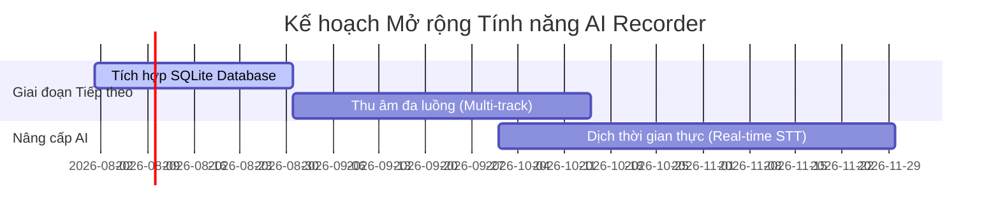

# Lộ trình Phát triển & Trạng thái Dự án — AI Recorder

Tài liệu này tóm tắt tiến độ, các cột mốc đã hoàn thành của dự án AI Recorder và định hướng phát triển trong tương lai.

---

## 🛠️ Trạng thái Hiện tại (Đã hoàn thành thêm Speaker Diarization)

Dự án đã hoàn thành toàn bộ các tính năng cốt lõi theo đúng đặc tả yêu cầu nghiệp vụ:

### 1. Nền tảng hệ thống (Setup & Architecture)
* **Backend:** Khởi dựng FastAPI trên nền Python 3.13 ổn định tại [main.py](file:///d:/KProject/AIRecorder/backend/app/main.py), hỗ trợ CORS, xử lý lỗi toàn cục và khôi phục trạng thái lỗi sau khi tắt server đột ngột.
* **Frontend:** Cấu hình thành công Electron + Vite + React Renderer. Thiết lập Vite build tool chạy mượt mà. Đã tích hợp Vitest & React Testing Library cho kiểm thử giao diện React cấu hình tại [package.json](file:///d:/KProject/AIRecorder/frontend/package.json).

### 2. Thu âm & Phát lại (Recording & Playback)
* **Trộn nguồn (Mixed Audio):** Thu âm đồng thời cả Microphone và Loa hệ thống (System WASAPI Loopback). Tích hợp bộ trộn bất đồng bộ tại [audio_mixer.py](file:///d:/KProject/AIRecorder/backend/app/services/audio_mixer.py) và điều khiển bởi [recorder.py](file:///d:/KProject/AIRecorder/backend/app/services/recorder.py).
* **Quản lý dữ liệu:** Lưu trữ tệp tin nhị phân WAV chất lượng cao (PCM 16-bit, 16kHz, Mono) kết hợp metadata dạng JSON tự đóng gói thông qua [repository.py](file:///d:/KProject/AIRecorder/backend/app/services/repository.py).
* **Tương tác:** Hỗ trợ đầy đủ các thao tác Tạm dừng (Pause), Tiếp tục (Resume), Dừng (Stop), Xóa bản ghi (Delete) và tua phát nhạc (Seek) theo mốc thời gian.

### 3. Dịch giọng nói Local (Speech-to-Text)
* **ASR Offline:** Chạy local hoàn toàn dưới CPU bằng thư viện `sherpa-onnx` với mô hình Zipformer 68M tiếng Việt tối ưu hóa siêu nhẹ tại [zipformer.py](file:///d:/KProject/AIRecorder/backend/app/services/zipformer.py), nạp mô hình theo cơ chế lazy-load.
* **Dấu câu tự động (Punctuation Restoration):** Tích hợp thành công mô hình ONNX `ViBERT-capu` chạy local dưới CPU để phục hồi dấu chấm, phẩy, và viết hoa tự động tại [restorer.py](file:///d:/KProject/AIRecorder/backend/app/services/punctuation/restorer.py).
* **Chống tràn RAM (WAV Chunking):** Tự động chia nhỏ tệp âm thanh dài thành các đoạn 50 giây giúp ngăn chặn lỗi tràn RAM trên các tệp ghi âm dài.
* **Giao diện:** Bản dịch được hiển thị chia theo câu kèm mốc thời gian (Segment timestamp) và tính năng click-to-seek phát lại.

### 4. Phân biệt người nói Local (Speaker Diarization)
* **Mô hình AI:** Tích hợp mô hình CAM++ ONNX (`3D-Speaker`) chạy local dưới CPU trích xuất đặc trưng giọng nói 192 chiều tại [diarization.py](file:///d:/KProject/AIRecorder/backend/app/services/diarization.py).
* **Gom cụm tự động:** Sử dụng K-Means++ kèm Silhouette Score để tự động phát hiện số lượng người nói tối ưu ($K \in [2, 4]$).
* **Tối ưu độc thoại (Centroid Merging):** Tự động so sánh độ tương đồng cosine giữa các tâm cụm để gộp về $K=1$ nếu độ tương đồng $> 0.80$ (giúp hiển thị sạch sẽ khi độc thoại).
* **Giao diện UI:** Hiển thị Badge màu tương ứng từng người nói (`[Người nói 0]`, `[Người nói 1]`,...) trực quan bên cạnh timestamps.

### 5. Tóm tắt nội dung AI (AI Summary)
* **AI Provider:** Tích hợp thành công các nhà cung cấp Generative AI hàng đầu (Google Gemini, OpenAI ChatGPT, và Anthropic Claude) chạy xử lý ngầm qua FastAPI Background Tasks thông qua [llm.py](file:///d:/KProject/AIRecorder/backend/app/services/llm.py). Mặc định hỗ trợ nhiều dòng mô hình khác nhau và cho phép chuyển đổi linh hoạt.
* **Thông tin tóm tắt:** Phân tách kết quả tóm tắt cuộc họp thành 3 phần rõ ràng: Tổng quan (Summary), Ý chính (Key Points), và Đầu việc cần làm (Action Items).
* **Xuất báo cáo:** Chức năng xuất báo cáo Markdown (.md) đẹp mắt từ giao diện Electron.

---

## 🚀 Kế hoạch Phát triển Tương lai (Future Roadmap)

Để nâng cấp AI Recorder trở thành một sản phẩm thương mại hoàn chỉnh, các phase tiếp theo được đề xuất triển khai:

### 1. Tích hợp SQLite Database
* **Vấn đề hiện tại:** Đọc ghi file phẳng trực tiếp (`metadata.json`) rất đơn giản và an toàn cho số lượng bản ghi nhỏ, nhưng sẽ bị giảm hiệu năng tìm kiếm/sắp xếp khi danh sách bản ghi lên tới hàng nghìn.
* **Giải pháp:** Chuyển đổi cơ chế CRUD Metadata sang cơ sở dữ liệu SQLite local để tối ưu hóa truy vấn, lọc và tìm kiếm toàn văn (Full-Text Search - FTS) nội dung bản dịch.

### 2. Thu âm đa luồng (Multi-track Audio)
* **Mục tiêu:** Lưu trữ độc lập file WAV của Microphone gốc và file WAV của System Audio gốc bên cạnh file trộn chung.
* **Lợi ích:** Cho phép người dùng hoặc các thuật toán lọc tạp âm xử lý riêng biệt từng kênh âm thanh để đạt chất lượng tốt nhất.

### 3. Dịch giọng nói thời gian thực (Real-time STT / Streaming Transcript)
* **Mục tiêu:** Hiển thị trực tiếp văn bản đang dịch ngay khi người dùng đang nói (trong quá trình thu âm), không cần đợi bấm Stop.
* **Giải pháp:** Sử dụng mô hình nhận dạng streaming của `sherpa-onnx` kết hợp giao tiếp WebSockets giữa Backend và Frontend Electron.
